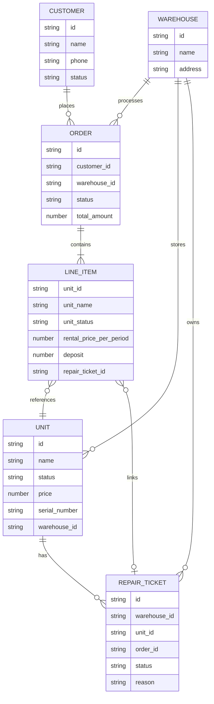

```mermaid
erDiagram
    CUSTOMER {
        string id
        string name
        string phone
        string status
    }

    WAREHOUSE {
        string id
        string name
        string address
    }

    ORDER {
        string id
        string customer_id
        string warehouse_id
        string status
        number total_amount
    }

    LINE_ITEM {
        string unit_id
        string unit_name
        string unit_status
        number rental_price_per_period
        number deposit
        string repair_ticket_id
    }

    UNIT {
        string id
        string name
        string status
        number price
        string serial_number
        string warehouse_id
    }

    REPAIR_TICKET {
        string id
        string warehouse_id
        string unit_id
        string order_id
        string status
        string reason
    }

    CUSTOMER ||--o{ ORDER : places
    WAREHOUSE ||--o{ ORDER : processes
    WAREHOUSE ||--o{ UNIT : stores
    WAREHOUSE ||--o{ REPAIR_TICKET : owns
    ORDER ||--|{ LINE_ITEM : contains
    LINE_ITEM }o--|| UNIT : references
    LINE_ITEM }o--o| REPAIR_TICKET : links
    UNIT ||--o{ REPAIR_TICKET : has
```
