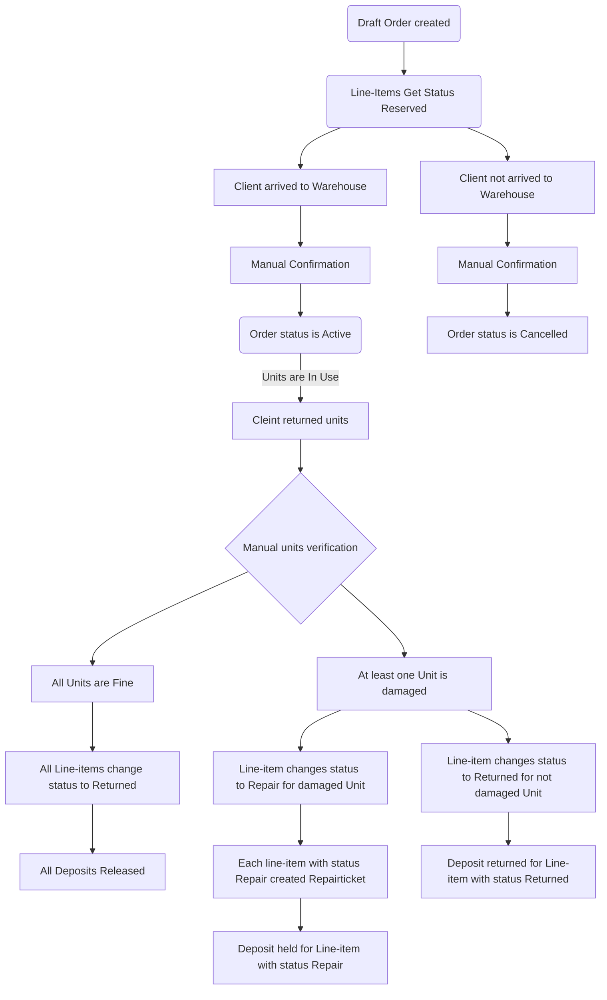

```mermaid
flowchart TD

    %% Бронироваие
    A(Draft Order created) --> B(Line-Items Get Status Reserved)

    %% Выдача
    B --> G[Client arrived to Warehouse]
    G --> I[Manual Confirmation]
    B --> D[Client not arrived to Warehouse]
    D --> E[Manual Confirmation]
    E --> F[Order status is Cancelled]
    I --> J(Order status is Active)

    %% Возврат
    J -->|Units are In Use| K[Cleint returned units]
    K --> L{Manual units verification}
    L --> M[All Units are Fine] 
    M --> N[All Line-items change status to Returned]
    L --> O[At least one Unit is damaged]
    O --> P[Line-item changes status to Repair for damaged Unit]
    P --> R[Each line-item with status Repair created Repairticket]
    O --> T[Line-item changes status to Returned for not damaged Unit]

    %% Расчет
    N --> Q[All Deposits Released]
    R --> S[Deposit held for Line-item with status Repair]
    T --> U[Deposit returned for Line-item with status Returned]
```
