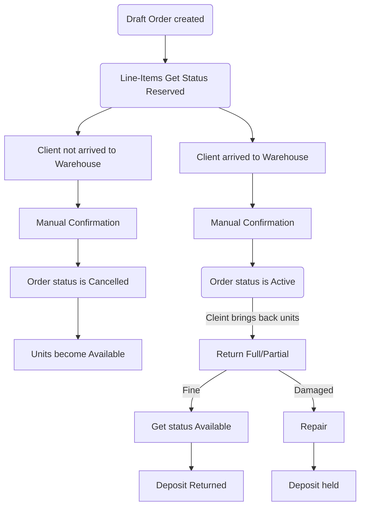

```mermaid
flowchart TD

    %% Бронироваие
    A(Draft Order created) --> B(Line-Items Get Status Reserved)

    %% Выдача
    B --> G[Client arrived to Warehouse]
    G --> I[Manual Confirmation]
    B --> D[Client not arrived to Warehouse]
    D --> E[Manual Confirmation]
    E --> F[Order status is Cancelled]
    F --> Z[Units become Available]
    I --> J(Order status is Active)

    %% Возврат
    J -->|Cleint brings back units| K[Return Full/Partial]
    K -->|Fine| M[Get status Available]
    K -->|Damaged| N[Repair]

    %% Расчет
    M --> O[Deposit Returned]
    N --> P[Deposit held]
```
