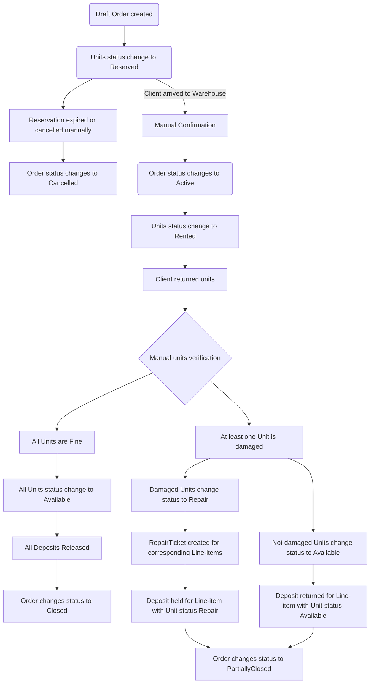

```mermaid
flowchart TD

    %% Бронироваие
    A(Draft Order created) --> B(Units status change to Reserved)

    %% Выдача
    B --> |Client arrived to Warehouse| I[Manual Confirmation]
    B --> E[Reservation expired or cancelled manually]
    E --> F[Order status changes to Cancelled]
    I --> J(Order status changes to Active)

    %% Возврат
    J --> X[Units status change to Rented]
    X --> K[Client returned units]
    K --> L{Manual units verification}
    L --> M[All Units are Fine] 
    M --> N[All Units status change to Available]
    L --> O[At least one Unit is damaged]
    O --> P[Damaged Units change status to Repair]
    P --> R[RepairTicket created for corresponding Line-items]
    O --> T[Not damaged Units change status to Available]

    %% Расчет
    N --> Q[All Deposits Released]
    Q --> V[Order changes status to Closed]
    R --> S[Deposit held for Line-item with Unit status Repair]
    T --> U[Deposit returned for Line-item with Unit status Available]
    S --> W[Order changes status to PartiallyClosed]
    U --> W[Order changes status to PartiallyClosed]
```
