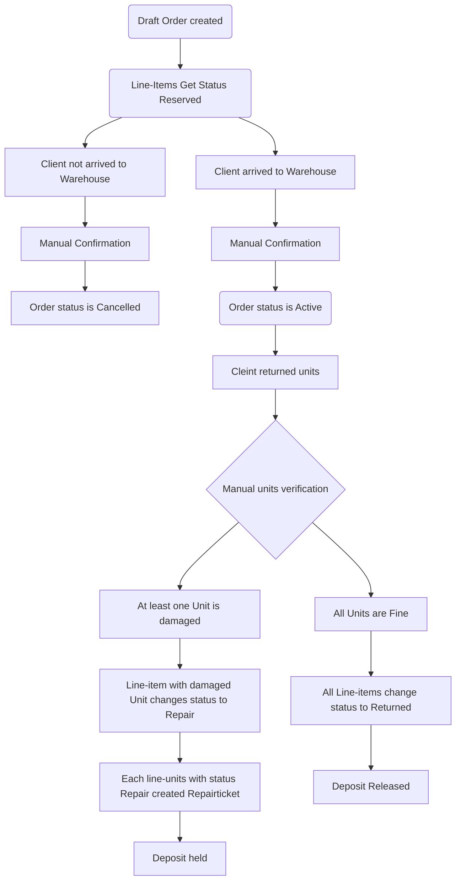

```mermaid
flowchart TD

    %% Бронироваие
    A(Draft Order created) --> B(Line-Items Get Status Reserved)

    %% Выдача
    B --> G[Client arrived to Warehouse]
    G --> I[Manual Confirmation]
    B --> D[Client not arrived to Warehouse]
    D --> E[Manual Confirmation]
    E --> F[Order status is Cancelled]
    I --> J(Order status is Active)

    %% Возврат
    J --> K[Cleint returned units]
    K --> L{Manual units verification}
    L --> M[All Units are Fine] 
    M --> N[All Line-items change status to Returned]
    L --> O[At least one Unit is damaged]
    O --> P[Line-item with damaged Unit changes status to Repair]
    P --> R[Each line-units with status Repair created Repairticket]

    %% Расчет
    N --> Q[Deposit Released]
    R --> S[Deposit held]
```
