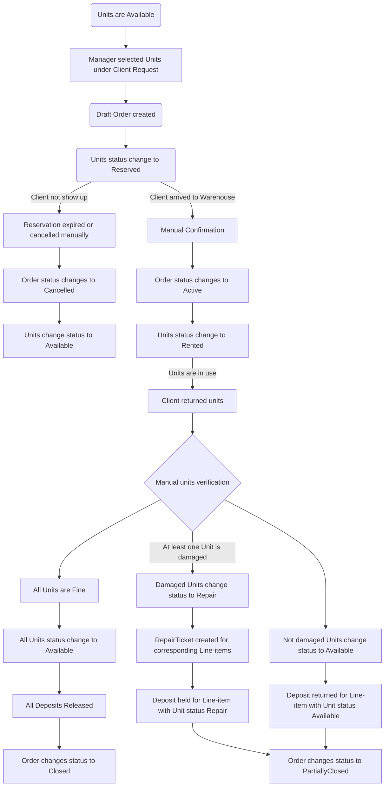

```mermaid
flowchart TD

    %% Бронироваие
    A1(Units are Available) --> A2[Manager selected Units under Client Request]
    A2 --> A(Draft Order created)
    A --> B(Units status change to Reserved)

    %% Выдача
    B --> |Client arrived to Warehouse| I[Manual Confirmation]
    B --> |Client not show up| E[Reservation expired or cancelled manually]
    E --> F[Order status changes to Cancelled]
    I --> J[Order status changes to Active]
    F --> C[Units change status to Available]
    J --> X[Units status change to Rented]

    %% Возврат
    X --> |Units are in use| K[Client returned units]
    K --> L{Manual units verification}
    L --> M[All Units are Fine] 
    M --> N[All Units status change to Available]
    L -->|At least one Unit is damaged| P[Damaged Units change status to Repair]
    P --> R[RepairTicket created for corresponding Line-items]
    L --> T[Not damaged Units change status to Available]

    %% Расчет
    N --> Q[All Deposits Released]
    Q --> V[Order changes status to Closed]
    R --> S[Deposit held for Line-item with Unit status Repair]
    T --> U[Deposit returned for Line-item with Unit status Available]
    S --> W[Order changes status to PartiallyClosed]
    U --> W[Order changes status to PartiallyClosed]
```
