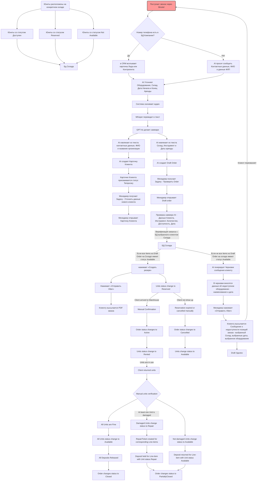

```mermaid
flowchart TD

 %% Выделение цветом
    style F00 fill:#ff9999,stroke:#333,stroke-width:2px
    
    %% Юниты на складе
    A1(Юниты расположены на конкретном складе) --> A2[Юниты со статутом Доступен]
    A1 --> A3[Юниты со статусом Reserved]
    A1 --> A5[Юниты со статусом Not Available]   
    A2 --> A4[БД Склада]
    A3 --> A4[Бд Склада]
    A5 --> A4
  
    %% Звонок
    F00(Поступает звонок через Binotel) --> F0{Номер телефона есть в БД Компании?}
    F0 -->|Да| F1[в CRM всплывает карточка Лида или Контрагента]
    F1 --> F11[AI Уточняет Оборудование, Склад, Дата Начала и Конец Аренды]
    F0 -->|Нет| F2[AI просит сообщить Контактные данные, ФИО и данные ФЛП]
    F2 --> F11

    %% AI-обработка действующего клиента
    F11 --> B0[Система скачивает аудио]
    B0 --> B1[Whisper переводит в текст]
    B1 --> B2[GPT-4o делает саммари]

    %% Создание Карточки клиента 
    B2 --> B3[AI извлекает из текста контактные данные, ФИО и название организации]
    B3 --> B31[AI создает Карточку Клиента]
    B31 --> B32[Карточке Клиента присваивается статус Temporary]
    B32 --> B33[Менеджер получает Задачу - Уточнить данные нового клиента]
    B33 --> B34[Менеджер открывает Карточку Клиента]

    %% Создание Order Draft
    B2 --> B6[AI извлекает из текста Склад, Инструмент и Даты аренды]
    B6 --> B7[AI создает Draft Order]

    %% Сотрудник
    B7 --> C0[Менеджер получает Задачу - Проверить Order]
    C0 --> C1[Менеджер открывает Draft order]
    C1 --> C2[Проверка саммери AI - Данные Клиента, Инструмент, Количество, Доступность, Дата]
    C2 --> |Верификация запроса с БД выбранного клиентом Склада| C3[БД Склада]

    C3 --> |Если все Items из Draft Order на Cкладе имеют статус Available| D1[нажимает «Создать резерв»]
    C3 --> |Если не все Items из Draft Order на складе имеют статус Available| D2[AI генерирует Черновик сообщения клиенту]
    D2 --> D21[В черновки вносятся данные об недоступном оборудовании - наименование и дата]
    D21 --> D22[Менеджер нажимает «Отправить Viber»]
    D22 --> D23[Клиенту высылается Сообщение о недоступности позиций заказа - выбранный Склад, выбранные даты, выбранное оборудование]
    D23 --> D24[Draft Удален]
    D23 --> |Клиент перезваниет|F00

    %% Подтверждение
    D1 --> D3[Нажимает «Отправить Viber»]
    D3 --> D4[Клиенту высылается PDF заказа] 
    D1 --> B(Units status change to Reserved)

    %% Выдача
    B --> |Client arrived to Warehouse| I[Manual Confirmation]
    B --> |Client not show up| E[Reservation expired or cancelled manually]
    E --> F[Order status changes to Cancelled]
    I --> J[Order status changes to Active]
    F --> C[Units change status to Available]
    J --> X[Units status change to Rented]

    %% Возврат
    X --> |Units are in use| K[Client returned units]
    K --> L{Manual units verification}
    L --> M[All Units are Fine] 
    M --> N[All Units status change to Available]
    L -->|At least one Unit is damaged| P[Damaged Units change status to Repair]
    P --> R[RepairTicket created for corresponding Line-items]
    L --> T[Not damaged Units change status to Available]

    %% Расчет
    N --> Q[All Deposits Released]
    Q --> V[Order changes status to Closed]
    R --> S[Deposit held for Line-item with Unit status Repair]
    T --> U[Deposit returned for Line-item with Unit status Available]
    S --> W[Order changes status to PartiallyClosed]
    U --> W[Order changes status to PartiallyClosed]
```
