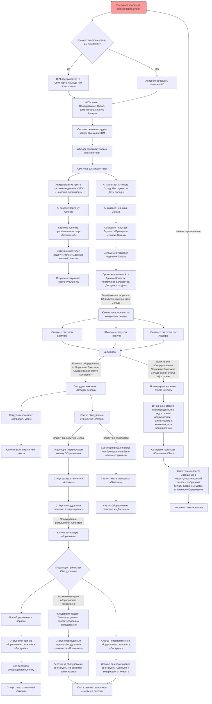

```mermaid
flowchart TD

 %% Выделение цветом
    style F00 fill:#ff9999,stroke:#333,stroke-width:2px
    
    %% Юниты на складе
    A1(Юниты расположены на конкретном складе) --> A2[Юниты со статутом Доступен]
    A1 --> A3[Юниты со статусом Reserved]
    A1 --> A5[Юниты со статусом Not Available]   
    A2 --> A4[БД Склада]
    A3 --> A4[Бд Склада]
    A5 --> A4
  
    %% Звонок
    F00(Поступает входящий звонок через Binotel) --> F0{Номер телефона есть в БД Компании?}
    F0 -->|Да| F1[В AI подгружается из CRM карточка Лида или Контрагента]
    F1 --> F11[AI Уточняет Оборудование, Склад, Дата Начала и Конец Аренды]
    F0 -->|Нет| F2[AI просит сообщить данные ФЛП]
    F2 --> F11

    %% AI-обработка действующего клиента
    F11 --> B0[Система скачивает аудио запись звонка из CRM]
    B0 --> B1[Whisper переводит запись звонка в текст]
    B1 --> B2[GPT-4o анализирует текст]

    %% Создание Карточки клиента 
    B2 --> B3[AI извлекает из текста контактные данные, ФИО и название организации]
    B3 --> B31[AI создает Карточку Клиента]
    B31 --> B32[Карточке Клиента присваивается статус «Временный»]
    B32 --> B33[Сотрудник получает Задачу «Уточнить данные нового Клиента»]
    B33 --> B34[Сотрудник открывает Карточку Клиента]

    %% Создание Order Draft
    B2 --> B6[AI извлекает из текста Склад, Инструмент и Даты аренды]
    B6 --> B7[AI создает Черновик Заказа]

    %% Сотрудник
    B7 --> C0[Сотрудник получает Задачу - «Проверить Черновик Заказа»]
    C0 --> C1[Сотрудник открывает Черновик Заказа]
    C1 --> C2[Проверка саммери AI - Данные Клиента, Инструмент, Количество, Доступность, Дата]
    C2 --> |Верификация запроса с БД выбранного клиентом Склада| A1

    A4 --> |Если всё оборудование из Черновика Заказа на Cкладе имеют статус «Доступен»| D1[Сотрудник нажимает «Создать резерв»]
    A4 --> |Если не всё оборудование из Черновика Заказа на Складе имеют статус «Доступен»| D2[AI генерирует Черновик ответа клиенту]
    D2 --> D21[В Черновик Ответа вносятся данные о недоступном оборудовании - наименование и желаемая дата бронирования]
    D21 --> D22[Сотрудник нажимает «Отправить Viber»]
    D22 --> D23[Клиенту высылается Сообщение о недоступности позиций заказа - выбранный Склад, выбранные даты, выбранное оборудование]
    D23 --> D24[Черновик Заказа удален]
    D23 --> |Клиент перезванивает|F00

    %% Подтверждение
    D1 --> D3[Сотрудник нажимает «Отправить Viber»]
    D3 --> D4[Клиенту высылается PDF заказа] 
    D1 --> B(Статус оборудвания становится «Резерв»)

    %% Выдача
    B --> |Клиент приходит на Склад| I[Кладовщик подтверждает выдачу Оборудования]
    B --> |Клиент не появляется| E[Срок бронирования истек или бронирование было отменено вручную]
    E --> F[Статус заказа становится «Отменен»]
    I --> J[Статус заказа становится «Активен»]
    F --> C[Статус Оборудования становится «Доступен»]
    J --> X[Статус Оборудования становится «Арендовано»]

    %% Возврат
    X --> |Оборудование используется Клиентом| K[Клиент возвращает оборудвание]
    K --> L{Кладовщик принимает Оборудование}
    L --> M[Все оборудование в порядке] 
    M --> N[Статус всех единиц оборудования становится «Доступен»]
    L --> |Как минимум одно оборудование повреждено| P[Кладовщик создает Заявку на ремонт соответствующего оборудования]
    P --> R[Статус поврежденных единиц оборудования становится «В ремонте»]
    L --> T[Статус неповрежденного оборудования становится «Доступен»]

    %% Расчет
    N --> Q[Все депозиты возвращаются клиенту]
    Q --> V[Статус заказ становится «Закрыт»]
    R --> S[Депозит за оборудование со статусом «В ремонте» удерживается]
    T --> U[Депозит за оборудование со статусом «Доступен» возвращается клиенту]
    S --> W[Статус заказа становится «Частично закрыт»]
    U --> W[Статус заказа становится «Частично закрыт»]
```
