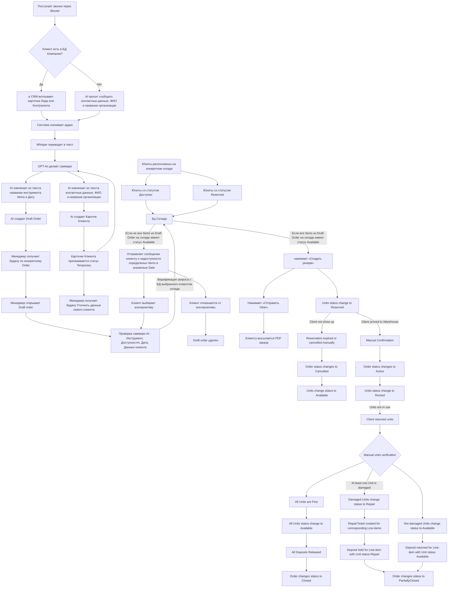

```mermaid
flowchart TD
    
    %% Юниты на складе
    A1(Юниты расположены на конкретном складе) --> A2[Юниты со статутом Доступен]
    A1 --> A3[Юниты со статусом Reserved]
    A2 --> A4[БД Склада]
    A3 --> A4[Бд Склада]
  
    %% Звонок
    B1(Поступает звонок через Binotel) --> F0{Клиент есть в БД Компании?}
    F0 -->|Да| B2[в CRM всплывает карточка Лида или Контрагента]
    F0 -->|Нет| B21[AI просит сообщить контактные данные, ФИО и название организации]

    %% AI-обработка действующего клиента
    B2 --> B3[Система скачивает аудио]
    B21 --> B3
    B3 --> B4[Whisper переводит в текст]
    B4 --> B5[GPT-4o делает саммари]
    

    %% Создание Карточки клиента 
    B5 --> B34[AI извлекает из текста контактные данные, ФИО и название организации]
    B34 --> B35[AI создает Карточк Клиента]
    B35 --> B36[Карточке Клиента присваивается статус Temporary]
    B36 --> 


    %% Создание Order Draft
    B5 --> B6[AI извлекает из текста название инструмента Items и Дату]
    B6 --> B7[AI создает Draft Order]

    %% Сотрудник
    B7 --> C0[Менеджер получает Задачу по конкретному Order]
    C0 --> C1[Менеджер открывает Draft order]
    C1 --> C2[Проверка саммери AI - Инструмент, Доступностm, Дата, Данных клиента]
    C2 --> |Верификация запроса с БД выбранного клиентом склада| A4[Бд Склада]
    A4 --> |Если все Items из Draft Order на складе имеют статус Available| D1[нажимает «Создать резерв»]
    A4 --> |Если не все Items из Draft Order на складе имеют статус Available| D2[Отправляет сообщение клиенту о недоступности определеных Items в указанные Date]
    B36 --> C01[Менеджер получает Задачу Уточнить данные нового клиента]
    
    %% Подтверждение
    D2 --> E1[Клиент выбирает альтернативу]
    E1 --> C2
    D2 --> E2[Клиент отказыается от альтернативы]
    E2 --> E3[Draft order удален]
    D1 --> D3[Нажимает «Отправить Viber»]
    D3 --> D4[Клиенту высылается PDF заказа] 
    D1 --> B(Units status change to Reserved)

    %% Выдача
    B --> |Client arrived to Warehouse| I[Manual Confirmation]
    B --> |Client not show up| E[Reservation expired or cancelled manually]
    E --> F[Order status changes to Cancelled]
    I --> J[Order status changes to Active]
    F --> C[Units change status to Available]
    J --> X[Units status change to Rented]

    %% Возврат
    X --> |Units are in use| K[Client returned units]
    K --> L{Manual units verification}
    L --> M[All Units are Fine] 
    M --> N[All Units status change to Available]
    L -->|At least one Unit is damaged| P[Damaged Units change status to Repair]
    P --> R[RepairTicket created for corresponding Line-items]
    L --> T[Not damaged Units change status to Available]

    %% Расчет
    N --> Q[All Deposits Released]
    Q --> V[Order changes status to Closed]
    R --> S[Deposit held for Line-item with Unit status Repair]
    T --> U[Deposit returned for Line-item with Unit status Available]
    S --> W[Order changes status to PartiallyClosed]
    U --> W[Order changes status to PartiallyClosed]
```
