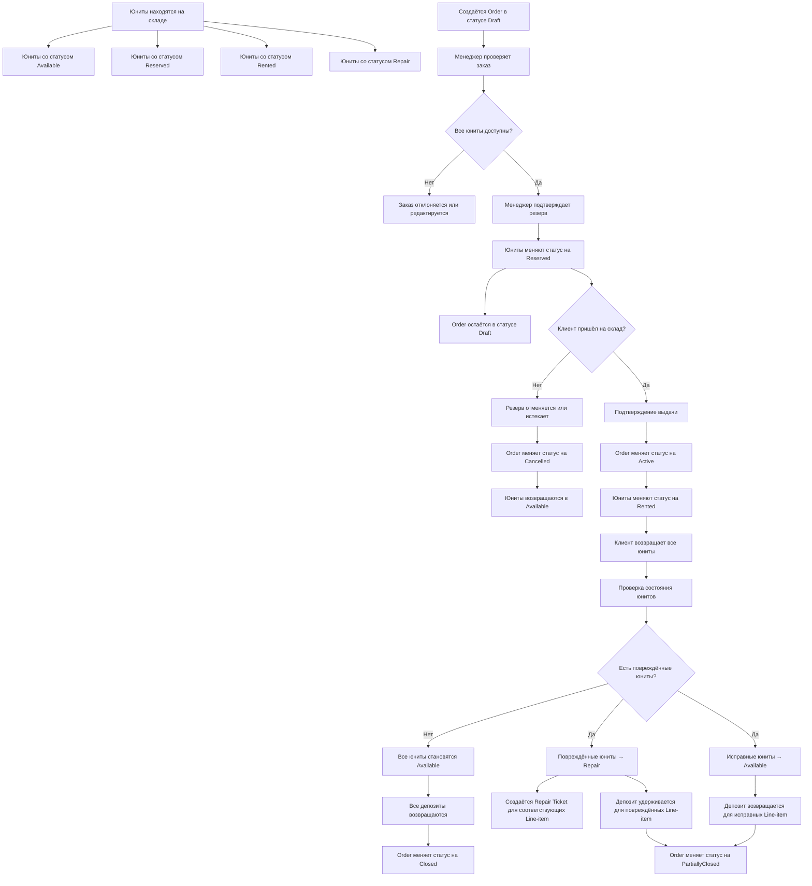

```mermaid
flowchart TD

%% ======================
%% Начальное состояние
%% ======================

A1[Юниты находятся на складе] --> A2[Юниты со статусом Available]
A1 --> A3[Юниты со статусом Reserved]
A1 --> A4[Юниты со статусом Rented]
A1 --> A5[Юниты со статусом Repair]

%% ======================
%% Создание заказа
%% ======================

B1[Создаётся Order в статусе Draft] --> B2[Менеджер проверяет заказ]

B2 --> B3{Все юниты доступны?}

B3 -->|Нет| B4[Заказ отклоняется или редактируется]
B3 -->|Да| B5[Менеджер подтверждает резерв]

%% ======================
%% Резервирование
%% ======================

B5 --> B6[Юниты меняют статус на Reserved]
B6 --> B7[Order остаётся в статусе Draft]

%% ======================
%% Выдача
%% ======================

B6 --> C1{Клиент пришёл на склад?}

C1 -->|Нет| C2[Резерв отменяется или истекает]
C2 --> C3[Order меняет статус на Cancelled]
C3 --> C4[Юниты возвращаются в Available]

C1 -->|Да| C5[Подтверждение выдачи]
C5 --> C6[Order меняет статус на Active]
C6 --> C7[Юниты меняют статус на Rented]

%% ======================
%% Возврат
%% ======================

C7 --> D1[Клиент возвращает все юниты]

D1 --> D2[Проверка состояния юнитов]

D2 --> D3{Есть повреждённые юниты?}

%% Все исправны
D3 -->|Нет| D4[Все юниты становятся Available]
D4 --> D5[Все депозиты возвращаются]
D5 --> D6[Order меняет статус на Closed]

%% Есть повреждения
D3 -->|Да| D7[Повреждённые юниты → Repair]
D7 --> D8[Создаётся Repair Ticket для соответствующих Line-item]

D3 -->|Да| D9[Исправные юниты → Available]

D7 --> D10[Депозит удерживается для повреждённых Line-item]
D9 --> D11[Депозит возвращается для исправных Line-item]

D10 --> D12[Order меняет статус на PartiallyClosed]
D11 --> D12
```
