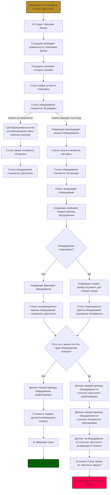

```mermaid
flowchart TD

 %% Выделение цветом
    style D0 fill:#BA8E23,stroke:#333,stroke-width:2px
    style V1 fill:#006400,stroke:#333,stroke-width:2px
    style W1 fill:#ff0150,stroke:#333,stroke-width:2px


    %% Подтверждение
    D0(Инструменты на складе в статусе «Доступно»)
    D0 --> D00[AI Создал Черновик Заказа]
    D00 --> D000[Сотрудник проверяет правильность Черновика Заказа]

    D000 --> D1[Сотрудник нажимает «Создать резерв»]
    D1 --> B[Статус заказа остается «Черновик»]
    B --> B1[Статус оборудования становится «В резерве»]


    %% Выдача
    B1 --> |Клиент приходит на Склад| I[Кладовщик подтверждает выдачу Оборудования]
    B1 --> |Клиент не появляется| E(Срок бронирования истек или бронирование было отменено вручную)
    E --> F[Статус заказа становится «Отменен»]
    I --> J[Статус заказа становится «Активен»]
    F --> C(Статус оборудования становится «Доступно»)
    J --> X[Статус оборудования становится «В аренде»]

    %% Возврат
    X --> K[Клиент возвращает оборудование]
    K --> L[Кладовщик проверяет каждую единицу оборудования]
    L --> M{Оборудование повреждено?}
    
    M --> |Да| P[Кладовщик создает Заявку на ремонт для позиции заказа]
    P --> R[Статус поврежденных единиц оборудования становится «В ремонте»]
    M --> |Нет| P1[Кладовщик принимает оборудование]
    P1 --> T[Статус неповрежденных единиц оборудования становится «Доступно»]

    %% Расчет
    T --> N{Есть ли в заказе хотя бы одна поврежденная позиция?}
    R --> N

    %%  Закрытие Заказа
    N --> |Нет| Q[Депозит каждой единицы оборудования разблокирован]
    Q --> Q1[Стоимость каждого депозита возвращена клиенту] 
    Q1 --> V[AI Закрывает заказ]
    V --> V1(Статус заказа «Закрыт»)

    N --> |Да| S[Депозит каждой единицы оборудования со статусом «Доступен» разблокирован]
    S --> S1[Депозит каждой единицы оборудования со статусом «В ремонте» заблокирован]
    S1 --> U[Депозит за оборудование со статусом «Доступно» возвращается клиенту]
    U --> W[AI меняет статус заказа на «Частично закрыт»]
    W --> W1(Статус заказа «Частично закрыт»)
```
