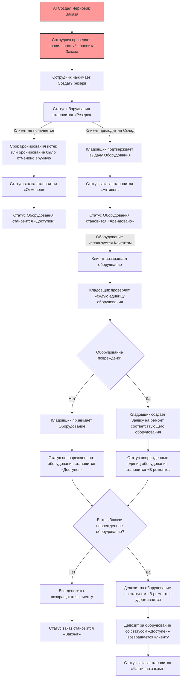

```mermaid
flowchart TD

 %% Выделение цветом
    style D0 fill:#ff9999,stroke:#333,stroke-width:2px
    style D00 fill:#ff9999,stroke:#333,stroke-width:2px

  

    %% Подтверждение
    D0[AI Создал Черновик Заказа]
    D0 --> D00[Сотрудник проверяет правильность Черновика Заказа]

    D00 --> D1[Сотрудник нажимает «Создать резерв»]
    D1 --> B(Статус оборудвания становится «Резерв»)

    %% Выдача
    B --> |Клиент приходит на Склад| I[Кладовщик подтверждает выдачу Оборудования]
    B --> |Клиент не появляется| E[Срок бронирования истек или бронирование было отменено вручную]
    E --> F[Статус заказа становится «Отменен»]
    I --> J[Статус заказа становится «Активен»]
    F --> C[Статус Оборудования становится «Доступен»]
    J --> X[Статус Оборудования становится «Арендовано»]

    %% Возврат
    X --> |Оборудование используется Клиентом| K[Клиент возвращает оборудвание]
    K --> L[Кладовщик проверяет каждую единицу оборудования]
    L --> M{Оборудование повреждено?}
    
    M --> |Да| P[Кладовщик создает Заявку на ремонт соответствующего оборудования]
    P --> R[Статус поврежденных единиц оборудования становится «В ремонте»]
    M --> |Нет| P1[Кладовщик принимает Оборудование]
    P1 --> T[Статус неповрежденного оборудования становится «Доступен»]

    %% Расчет
    T --> N{Есть в Заказе поврежденное оборудование?}
    R --> N
    N --> |Нет| Q[Все депозиты возвращаются клиенту]
    Q --> V[Статус заказ становится «Закрыт»]
    N --> |Да| S[Депозит за оборудование со статусом «В ремонте» удерживается]
    S --> U[Депозит за оборудование со статусом «Доступен» возвращается клиенту]
    U --> W[Статус заказа становится «Частично закрыт»]
```
