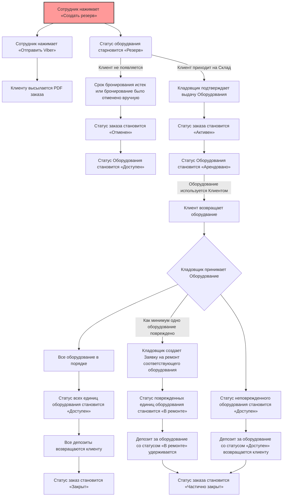

```mermaid
flowchart TD

 %% Выделение цветом
    style D1 fill:#ff9999,stroke:#333,stroke-width:2px
  
    D1[Сотрудник нажимает «Создать резерв»]

    %% Подтверждение
    D1 --> D3[Сотрудник нажимает «Отправить Viber»]
    D3 --> D4[Клиенту высылается PDF заказа] 
    D1 --> B(Статус оборудвания старновится «Резерв»)

    %% Выдача
    B --> |Клиент приходит на Склад| I[Кладовщик подтверждает выдачу Оборудования]
    B --> |Клиент не появляется| E[Срок бронирования истек или бронирование было отменено вручную]
    E --> F[Статус заказа становится «Отменен»]
    I --> J[Статус заказа становится «Активен»]
    F --> C[Статус Оборудования становится «Доступен»]
    J --> X[Статус Оборудования становится «Арендовано»]

    %% Возврат
    X --> |Оборудование используется Клиентом| K[Клиент возвращает оборудвание]
    K --> L{Кладовщик принимает Оборудование}
    L --> M[Все оборудование в порядке] 
    M --> N[Статус всех единиц оборудования становится «Доступен»]
    L --> |Как минимум одно оборудование повреждено| P[Кладовщик создает Заявку на ремонт соответствующего оборудования]
    P --> R[Статус поврежденных единиц оборудования становится «В ремонте»]
    L --> T[Статус неповрежденного оборудования становится «Доступен»]

    %% Расчет
    N --> Q[Все депозиты возвращаются клиенту]
    Q --> V[Статус заказ становится «Закрыт»]
    R --> S[Депозит за оборудование со статусом «В ремонте» удерживается]
    T --> U[Депозит за оборудование со статусом «Доступен» возвращается клиенту]
    S --> W[Статус заказа становится «Частично закрыт»]
    U --> W[Статус заказа становится «Частично закрыт»]
```
